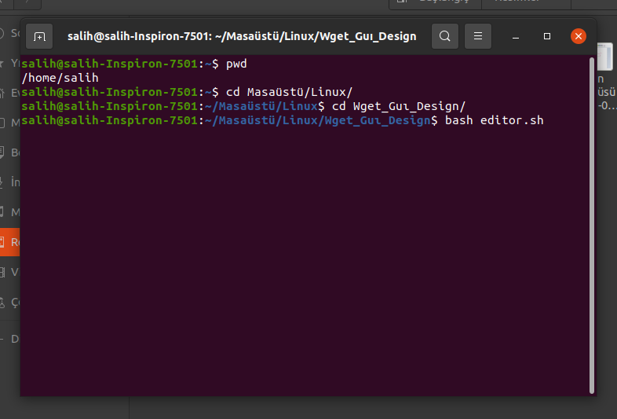
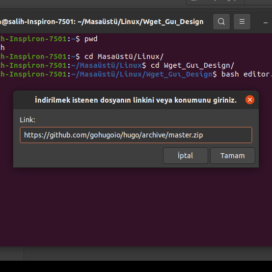
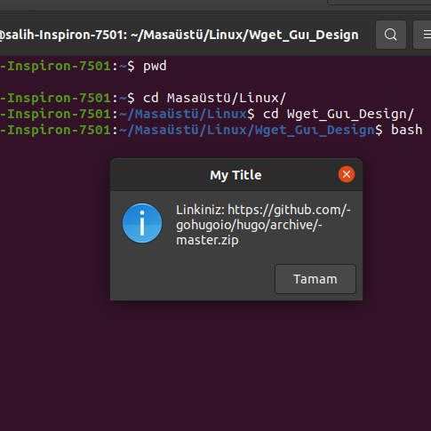
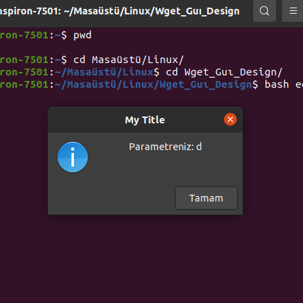
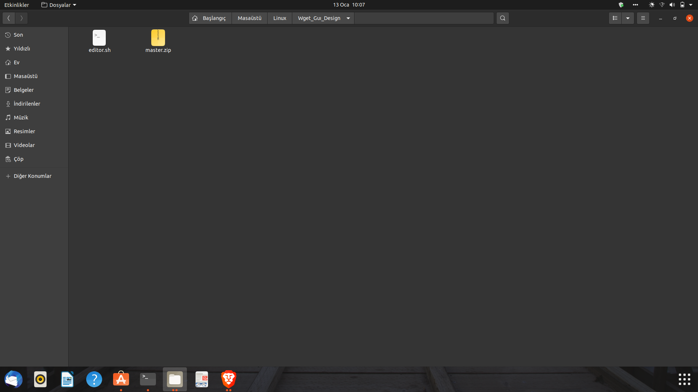

# **Wget_Gui_Interface**
There is a youtube link -->
My purpose is execute "Wget" command with visual interface. Therefore I decided to build my interface to run "Wget" command with 5 parameters.

## Installing
You need to download projects. Project work on a Shell.

## HowCanIRun
 Firstly, open terminal and go to directory for execute.
 
 
 
 Then you have to start with "bash filename".
 
 
 When you execute command you will see that screen.
 
 
At this point,you have to enter url that you want to download.
 
 
Then, this picture will appear on screen to inform.
 
 
 After that, you have to enter parameter that you want.
 
 
Then, this picture will appear on screen to inform again.
 
 
You must Wait while the file downloads.
 
 
 After finishing click "Tamam"
 
 
 Congratulations, you downloaded the file with GUI.
  
 
 
 

## Built With

*[Zenity](https://help.gnome.org/users/zenity/stable/) 

## Author

 *Mehmet Salih Önder
